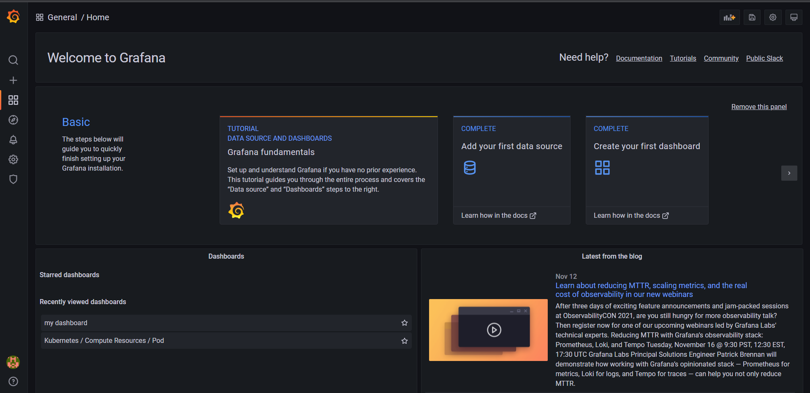
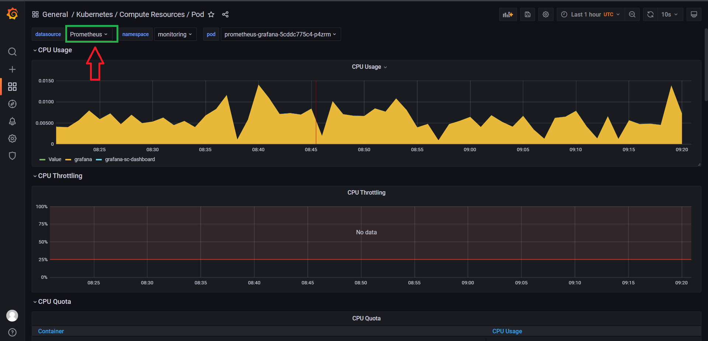

**Note:** For the screenshots, you can store all of your answer images in the `answer-img` directory.

## Verify the monitoring installation

run `kubectl` command to show the running pods and services for all components. Take a screenshot of the output and include it here to verify the installation
```
ram@LAPTOP-QSM1JPGC:~/udacity/CNAND_nd064_C4_Observability_Starter_Files/Project_Starter_Files-Building_a_Metrics_Dashboard$ kubectl get po -n monitoring
NAME                                                     READY   STATUS    RESTARTS   AGE
alertmanager-prometheus-kube-prometheus-alertmanager-0   2/2     Running   4          2d15h
prometheus-grafana-55464db9f4-7r4mq                      2/2     Running   4          2d15h
prometheus-kube-prometheus-operator-86d499db8f-hqtkf     1/1     Running   2          2d15h
prometheus-kube-state-metrics-58c5cd6ddb-l24jf           1/1     Running   3          2d15h
prometheus-prometheus-kube-prometheus-prometheus-0       2/2     Running   4          2d15h
prometheus-prometheus-node-exporter-tkcvg                1/1     Running   1          10h
```
```
ram@LAPTOP-QSM1JPGC:~/udacity/CNAND_nd064_C4_Observability_Starter_Files/Project_Starter_Files-Building_a_Metrics_Dashboard$ kubectl get svc -n monitoring
NAME                                      TYPE        CLUSTER-IP       EXTERNAL-IP   PORT(S)                      AGE
alertmanager-operated                     ClusterIP   None             <none>        9093/TCP,9094/TCP,9094/UDP   2d15h
prometheus-grafana                        ClusterIP   10.97.236.207    <none>        80/TCP                       2d15h
prometheus-kube-prometheus-alertmanager   ClusterIP   10.107.109.105   <none>        9093/TCP                     2d15h
prometheus-kube-prometheus-operator       ClusterIP   10.109.3.242     <none>        443/TCP                      2d15h
prometheus-kube-prometheus-prometheus     ClusterIP   10.107.9.237     <none>        9090/TCP                     2d15h
prometheus-kube-state-metrics             ClusterIP   10.111.14.21     <none>        8080/TCP                     2d15h
prometheus-operated                       ClusterIP   None             <none>        9090/TCP                     2d15h
prometheus-prometheus-node-exporter       ClusterIP   10.108.159.152   <none>        9100/TCP                     2d15h
```
Pods and services in observability namespace:
```
ram@LAPTOP-QSM1JPGC:~/udacity/CNAND_nd064_C4_Observability_Starter_Files/Project_Starter_Files-Building_a_Metrics_Dashboard$ kubectl get po -n observability
NAME                                 READY   STATUS    RESTARTS   AGE
jaeger-operator-694cbbb886-44qwm     1/1     Running   2          2d18h
my-jaeger-tracing-7d4967df8f-vpsn4   1/1     Running   0          12m
```
```
ram@LAPTOP-QSM1JPGC:~/udacity/CNAND_nd064_C4_Observability_Starter_Files/Project_Starter_Files-Building_a_Metrics_Dashboard$ kubectl get svc -n observability
NAME                                   TYPE        CLUSTER-IP      EXTERNAL-IP   PORT(S)                                  AGE
jaeger-operator-metrics                ClusterIP   10.101.73.63    <none>        8383/TCP,8686/TCP                        2d18h
my-jaeger-tracing-agent                ClusterIP   None            <none>        5775/UDP,5778/TCP,6831/UDP,6832/UDP      14m
my-jaeger-tracing-collector            ClusterIP   10.105.93.69    <none>        9411/TCP,14250/TCP,14267/TCP,14268/TCP   14m
my-jaeger-tracing-collector-headless   ClusterIP   None            <none>        9411/TCP,14250/TCP,14267/TCP,14268/TCP   14m
my-jaeger-tracing-query                ClusterIP   10.96.174.116   <none>        16686/TCP,16685/TCP                      14m
```
Pods and services in default namespace:
```
ram@LAPTOP-QSM1JPGC:~/udacity/CNAND_nd064_C4_Observability_Starter_Files/Project_Starter_Files-Building_a_Metrics_Dashboard$ kubectl get poNAME                            READY   STATUS    RESTARTS   AGE
backend-587fcbbd74-v255j        1/1     Running   0          91s
frontend-app-5f6dc66d75-mnddl   1/1     Running   0          24m
my-release-kafka-0              1/1     Running   5          3d23h
my-release-zookeeper-0          1/1     Running   3          3d23h
trial-app-56f75b8cd9-p9b8x      1/1     Running   0          24m
```
```
ram@LAPTOP-QSM1JPGC:~/udacity/CNAND_nd064_C4_Observability_Starter_Files/Project_Starter_Files-Building_a_Metrics_Dashboard$ kubectl get svc
NAME                            TYPE           CLUSTER-IP       EXTERNAL-IP   PORT(S)                      AGE
backend-service                 LoadBalancer   10.97.62.203     localhost     8081:30380/TCP               2d19h
frontend-service                LoadBalancer   10.97.192.75     localhost     8082:32409/TCP               2d19h
kubernetes                      ClusterIP      10.96.0.1        <none>        443/TCP                      3d23h
my-release-kafka                ClusterIP      10.104.141.103   <none>        9092/TCP                     3d23h
my-release-kafka-headless       ClusterIP      None             <none>        9092/TCP,9093/TCP            3d23h
my-release-zookeeper            ClusterIP      10.111.253.129   <none>        2181/TCP,2888/TCP,3888/TCP   3d23h
my-release-zookeeper-headless   ClusterIP      None             <none>        2181/TCP,2888/TCP,3888/TCP   3d23h
trial-service                   LoadBalancer   10.110.158.6     localhost     8083:31866/TCP               2d19h
```

* [All pods](answer-img/pods.png)
* [All services](answer-img/services.png)


## Setup the Jaeger and Prometheus source
Expose Grafana to the internet and then setup Prometheus as a data source. Provide a screenshot of the home page after logging into Grafana.



## Create a Basic Dashboard
Create a dashboard in Grafana that shows Prometheus as a source. Take a screenshot and include it here.



## Describe SLO/SLI
Describe, in your own words, what the SLIs are, based on an SLO of *monthly uptime* and *request response time*.

**SLI** (Service Level Indicator) is basically a well defined quantitative measure of some level of service, in other words which can also be termed as "reality" metric.
**SLO** (Service Level Objective) is like a target value of service level measured by SLI, or in other words a reliavility target any team wants to achieve. It is like a "desired reality" metric.

**Example:** 
In terms of Monthly uptime, lets say we have an SLI of 96.9% for the month of october 2021, for an SLO of 96% for the month of october 2021.

In terms of request response time, we can have an SLI of average request response time of 188ms for the month of october 2021, for an SLO of 190ms of request response time for the month of october 2021.


## Creating SLI metrics.
It is important to know why we want to measure certain metrics for our customer. Describe in detail 5 metrics to measure these SLIs. 

* Below can be the 5 metrics to measure SLIs:

1- **Error rate:** It is basically an indicator of downtime. How much down-time is caused by the error rate and is under the Error Budget, which is the (100% uptime - SLO) - meaning that we should be under our allowed limits of a specific period of time. This metric is very important because Down Time is inevitable, but should be kept to minimum as it reflects the business and clients directly.

2- **Uptime:** It is a direct mesaurement of our Service Availability during a period of time. All mterics are interrelated with the Uptime metric in one way or another, they can be some sort of a cause that effects this metric. It will also measure how much our service is accesible and serving properly during a peiod of time. We monitor and measure response times and available services by targeting certain ports/services.

3- **Latency:** It is a metric to measure response time of the user an API offers. How much delay does the customer experience when interacting/using our service during a period of time. This is very important for the operation of business, as if left neglected can be cause of loosing clients, and it is dirct refelction of user experience.

4- **Traffic:** It is a metric to measure the amount of traffic one is getting during periods of time. Here we measure how much traffic we are getting during periods of time, where, what kind of traffic, and where the traffic is coming from and what is targetting. This is getting to know the other side and what is coming on our system. Kind of request, ports, which service is being targeted the most, if we offer multiple services to the outside world through the API. Which API calls are most acctively, etc.

5- **Network Capacity:** It is a metric to handle the request of the usage of a service. Even if we take care of Error Rate and Latency, if we don't have enough netowrk capacity and don't monitor how it is spent and what is causing spike on it, we eventually can lead to a road block of not being able to handel certain amount of network trrafic. Here we need to ensure that sufficient bandwidth is provisioned to meet our SLA/SLO targets of delay, jitter, loss, and availability of our Service.

## Create a Dashboard to measure our SLIs
Create a dashboard to measure the uptime of the frontend and backend services We will also want to measure to measure 40x and 50x errors. Create a dashboard that show these values over a 24 hour period and take a screenshot.
* [app dashboard 1](answer-img/app_grafana_dashboard.png)
* [app dashboard 2](answer-img/app_grafana_dashboard_2.png)

## Tracing our Flask App
We will create a Jaeger span to measure the processes on the backend. Once you fill in the span, provide a screenshot of it here.
* [jaeger app](answer-img/jaeger_app.png)

## Jaeger in Dashboards
Now that the trace is running, let's add the metric to our current Grafana dashboard. Once this is completed, provide a screenshot of it here.
* [grafana displaying jaeger traces](answer-img/grafana_jaeger.png)

## Report Error
Using the template below, write a trouble ticket for the developers, to explain the errors that you are seeing (400, 500, latency) and to let them know the file that is causing the issue.
```
TROUBLE TICKET
Name: Backend Issues
Date: 2021-11-28 / 7:00 pm 
Subject: mongodb setup is not done
Affected Area: backend application /star api failing
Severity: ERRORS
Description: mongodb setup is not done
```

## Creating SLIs and SLOs
We want to create an SLO guaranteeing that our application has a 99.95% uptime per month. Name three SLIs that you would use to measure the success of this SLO.
* Error rate
* Uptime
* Latency

## Building KPIs for our plan
Now that we have our SLIs and SLOs, create KPIs to accurately measure these metrics. We will make a dashboard for this, but first write them down here.

1- Error Rate: It can be measured using- http requests exceptions by container, jaeger traces by container, error response rate per second, success response rate per second etc.

2- Uptime (Total uptime for each service per Month which can be measured using frontend service/backend service/trial service uptime)

3- Latency: It can be measured using- frontend http service for 4xx and 5xx, backend http service 4xx and 5xx, number of successful/failure requests per second etc.

## Final Dashboard
Create a Dashboard containing graphs that capture all the metrics of your KPIs and adequately representing your SLIs and SLOs. Include a screenshot of the dashboard here, and write a text description of what graphs are represented in the dashboard.
* [final dashboard](answer-img/final_dashboard.png)

Dashboard contains below graphs:
- Graphs showing Frontend/backend services uptime
- Graphs showing jaeger tracing by containers
- Graphs showing http requests, error/success response rate
- Graphs showing memory/cpu/io usage
- Graphs showing network traffic
- Graphs showing frontend http service for 4xx and 5xx, backend http service 4xx and 5xx
